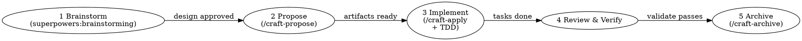

# Spec-Driven SDLC

## Overview
Turn a problem statement into shipped, verified code through structured exploration, OpenSpec
artifacts, and Superpowers process discipline. You ask; you don't assume.

<HARD-GATE>
Do NOT write any code, create any OpenSpec change, or invoke any implementation skill
until you have used superpowers:brainstorming and the user has approved the design.
This applies to every change regardless of perceived simplicity.
</HARD-GATE>

## Step 0 — Understand the problem first (always)
If the problem statement is missing or vague, use **AskUserQuestion** (open-ended):
> "What do you want to build or fix? Describe the problem and what success looks like."

One question at a time. Don't ask multiple questions in one message. Ask the most
important thing first; ask follow-ups based on answers.

Read `PROJECT.md` and `AGENTS.md` for this project's context before acting.

## Pipeline

| Phase | Skill to use | What it does | Gate |
|-------|--------------|--------------|------|
| 1 Explore & design | `superpowers:brainstorming` | Clarify intent; propose 2-3 approaches; produce a **design brief** (NOT the final spec) | **User approves design direction** |
| 2 OpenSpec artifacts | `/craft-propose` | Creates `proposal.md`, `specs/`, `design.md`, `tasks.md` via `openspec` CLI — these are the **canonical spec** | `openspec status` shows all artifacts done |
| 3 Implement (TDD) | `/craft-apply` + `implementing-with-tdd` | Walks tasks, writes failing test first for each, flips `[ ]`→`[x]` | Tests pass + `openspec validate` |
| 4 Review & verify | `/craft-review` + `reviewing-and-verifying` | Spec compliance → quality → security → definition of done | `openspec validate --strict` |
| 5 Archive | `/craft-archive` | Merges delta specs, moves to dated archive | Deltas merged to `openspec/specs/` |

<IMPORTANT>
**Phase 1 output is a design brief, NOT the spec.** The brainstorming skill may write a design
doc to `docs/superpowers/specs/`. That document is a working draft used to reach alignment with
the user. It is NOT the canonical spec. After user approval, you MUST proceed to Phase 2
(`/craft-propose`) which creates the real OpenSpec artifacts under `openspec/changes/<name>/`.
The OpenSpec change folder is the source of truth — not the brainstorming design doc.

Do NOT stop after Phase 1. Do NOT treat the brainstorming output as the final spec.
Always continue to Phase 2 to create proper OpenSpec artifacts.
</IMPORTANT>

## How to run each phase

**Phase 1 — Brainstorming (design brief only):**
Invoke the `superpowers:brainstorming` skill. It will explore context, ask clarifying
questions one at a time, propose approaches with trade-offs, and get design approval.
The brainstorming skill may write a design doc — this is a **working brief**, not the
final spec. After user approval, **immediately proceed to Phase 2**. Do not stop here.

**Phase 2 — OpenSpec artifacts (the real spec):**
Invoke `/craft-propose`. This creates the **canonical spec** under `openspec/changes/<name>/`.
It runs:
- `openspec new change "<kebab-name>"`
- `openspec status --change "<name>" --json` (get artifact order)
- `openspec instructions <artifact-id> --change "<name>" --json` (per artifact)
Creates `proposal.md`, `specs/<capability>/spec.md` (EARS format), `design.md`, and
`tasks.md` in dependency order. Use the brainstorming design brief as input context —
but write artifacts to the OpenSpec change folder, not to `docs/superpowers/specs/`.
Ask if anything is unclear rather than guessing.

**Phase 3 — Implement:**
Invoke `/craft-apply` (which drives the task list). For EACH task, follow the
`implementing-with-tdd` skill: write the failing test FIRST, then the minimum code to
pass it, then check off `- [ ]` → `- [x]`. Use `codebase-explorer` for context.

**Phase 4 — Review:**
Invoke `reviewing-and-verifying`. It dispatches `spec-reviewer` (read-only, strong
model) and uses `superpowers:verification-before-completion` before claiming anything.

**Phase 5 — Archive:**
Invoke `/craft-archive`. Delta specs merge into `openspec/specs/`.

## Trivial change exception
Pure questions, explanations, or one-line typo fixes: skip the pipeline. Answer directly.
Still: if a "simple" fix reveals unexpected complexity, restart from Phase 1.

## Related skills
- **REQUIRED Phase 1:** `superpowers:brainstorming`
- **REQUIRED Phase 2:** `/craft-propose`
- **REQUIRED Phase 3:** `/craft-apply`, `implementing-with-tdd`
- **REQUIRED Phase 4:** `/craft-review`, `reviewing-and-verifying`, `superpowers:verification-before-completion`
- **REQUIRED Phase 5:** `/craft-archive`
- **For bugs found:** `superpowers:systematic-debugging`
- **Context isolation:** dispatch `codebase-explorer` agent for repo exploration
